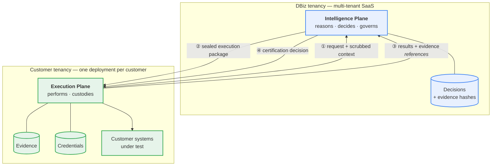

# 02 — Reference Architecture

**Status:** **FROZEN** · **Version:** 1.0 · **Date:** 2026-07-22 · **Milestone:** P1 / M1.2
**Governed by:** [01 — Platform Constitution](01-platform-constitution.md)

**This document owns:** the whole-system view — how the two planes, the execution package, and the evidence chain compose into one platform.
**It does not own:** the internals of either plane ([03](03-intelligence-plane-architecture.md), [04](04-execution-plane-architecture.md)), the transport ([05](05-cross-plane-communication.md)), or the contracts themselves ([20](20-cross-plane-contracts.md)).

---

## 1. The system in one view

**Every arrow originates in the customer tenancy.** There is no inbound path from DBiz into the customer (INV-3). What crosses outward is scrubbed context and evidence *references* — never evidence payloads, never secret material (INV-2, INV-6).

## 2. Composition

The platform composes in five layers. **Each layer may depend only on layers above it.** A downward dependency is an architecture violation.

| Layer | Contents | Resides |
|---|---|---|
| **L1 — Contracts** | Execution package, evidence contract, adapter interfaces, configuration schema | Shared, versioned ([19](19-repository-ownership.md), [20](20-cross-plane-contracts.md)) |
| **L2 — Governance** | Policy decision point, gates, certification authority | Intelligence Plane ([18](18-governance-model.md)) |
| **L3 — Capability** | The six capabilities and their shared orchestration lifecycle | Authored IP, sequenced EP ([11](11-capability-model.md), [12](12-capability-orchestration.md)) |
| **L4 — Runtime** | Composition, process model, concurrency, scheduling | Both planes ([16](16-runtime-model.md)) |
| **L5 — Adapters** | Tool, AI provider, and external-system implementations | Execution Plane ([14](14-tool-operating-model.md)) |

**Why contracts sit above governance.** A gate asserts conformance to something. If contracts could change beneath governance, every gate would churn with each contract revision, and governance would be measuring a moving target.

**Why adapters sit at the bottom.** Adapters are the only layer permitted to know a vendor's name (R-7.2). Placing them anywhere but the leaf would propagate vendor identity upward into layers that must remain tool-agnostic.

## 3. The end-to-end lifecycle

One run, nine steps. This is the platform's spine; every capability traverses it identically.

| # | Actor | Step |
|---|---|---|
| 1 | **EP** | Requests an execution package, supplying scrubbed, minimised context |
| 2 | **IP** | Reasons, authors, seals, and returns exactly one package |
| 3 | **EP** | Validates provenance, hash, validity window, and the proceed flag |
| 4 | **EP** | Sequences the package's operations in order |
| 5 | **EP** | Captures evidence, hashes it canonically, retains authoritative custody |
| 6 | **EP** | Returns results and evidence **references** — never payloads |
| 7 | **IP** | Evaluates deterministic gates over the returned references and results |
| 8 | **IP** | Renders the decision and authors the certification |
| 9 | **IP** | Retains the decision and hashes; the EP retains the evidence |

**Steps 1–2 are skippable** when a valid cached package exists. **Steps 4–5 SHALL always be possible**, because INV-7 requires execution to survive DBiz unavailability. **Steps 7–8 SHALL NOT be performed by the EP under any circumstance** (R-2.3, R-10.1).

**The asymmetry is deliberate.** Authoring is centralised so that reasoning improves for every customer at once. Sequencing is local so that no DBiz process ever holds a live handle inside a customer network.

## 4. The two artefacts that make the split work

Everything structural in this platform reduces to two objects.

### 4.1 The execution package

A **sealed, immutable, content-addressed** description of what shall be done — authored by the IP, sequenced by the EP, never modified by it (R-4.2, R-4.3). Its contents are specified in [20](20-cross-plane-contracts.md).

It converts orchestration from a *conversation* into an *artefact*. A conversation requires both parties live and reachable; an artefact can be cached, replayed, audited, and executed while its author is offline. **This is the mechanism by which INV-7 is achievable at all.**

### 4.2 The evidence reference

Evidence is captured and held by the EP. What crosses is a **reference plus a content hash** ([10](10-evidence-flow-model.md)).

This is what lets sovereignty and auditability coexist. A decision cites a hash rather than a payload, so:
- customer data never leaves the tenancy (INV-6),
- the decision remains independently verifiable, and
- **an expired evidence bundle leaves its decision record intact and still auditable.**

Neither plane can manufacture a certified result alone: the IP has judgment but no evidence; the EP has evidence but no judgment (INV-1).

## 5. Multiplicity and scale

| Element | Cardinality |
|---|---|
| Intelligence Plane deployment | **1 per region**, multi-tenant |
| Execution Plane deployment | **1 per customer tenancy** (potentially several per customer, by environment) |
| Tenants per Intelligence Plane | Hundreds |
| Concurrent executions per Execution Plane | Thousands |
| Execution package per run | Exactly **1** |

**Design consequences of this shape:**

- The IP is **stateless with respect to a run**. Run state lives in the package and in the EP. The IP may therefore scale horizontally without coordination.
- The EP is **single-tenant by construction** (R-2.5). It carries no tenant-routing logic, which removes an entire class of cross-tenant defect *structurally* rather than by test.
- Fan-out is a **per-tenancy** concern. Thousands of concurrent executions are absorbed by the customer's own deployment, so one customer's load cannot degrade another's — the split delivers noisy-neighbour isolation as a side effect.
- Only **reasoning** is a shared resource. Its cost and quota model is per tenant ([15](15-configuration-model.md)).

## 6. Evolution posture

This platform is intended to serve hundreds of customers for a decade. Two independently-owned deployables that upgrade on **different schedules** — DBiz continuously, customers on their own change calendars — means **version skew is the normal state, not an exception.**

| Concern | Position |
|---|---|
| Contract versioning | Every contract is explicitly versioned; a version is never reinterpreted ([20](20-cross-plane-contracts.md)) |
| Compatibility | The IP SHALL support every contract version still deployed in any customer tenancy |
| Skew direction | An EP may run **older** than the IP. An EP SHALL NOT require the IP to be older than itself |
| Evidence durability | Evidence outlives the algorithms that hashed it; every record carries its algorithm version ([10](10-evidence-flow-model.md)) |
| Capability addition | A new capability adds a registry entry and a lifecycle implementation. It SHALL NOT require a change to L1 or L2 |
| Tool addition | Implementing an adapter interface. It SHALL NOT require a change to any other layer ([14](14-tool-operating-model.md)) |
| Cloud portability | No layer above L5 may reference a cloud primitive directly ([17](17-deployment-topology.md)) |

**The compatibility rule is asymmetric on purpose.** DBiz controls its own upgrade cadence and can carry compatibility burden; a customer cannot be compelled to upgrade on DBiz's schedule. Requiring otherwise would make the split commercially unsellable.

## 7. What this architecture deliberately is not

| Not | Because |
|---|---|
| A test automation tool | It orchestrates tools; tools are replaceable adapters (R-7.1) |
| An AI agent framework | No autonomous loop, no model-selected control flow (R-8.5) |
| A single deployable product | Two deployables, two tenancies, two owners, two lifecycles (R-1.1) |
| A test management system | Those are external systems behind adapters (R-7.1) |
| A data platform | Customer data in the IP is ephemeral and authorised only (R-3.4, INV-6) |
| A system requiring AI | Every capability functions with AI disabled (R-8.1) |

## 8. Conformance criteria

| # | Criterion | Verified by |
|---|---|---|
| **C-02.1** | No layer depends on a layer below it | Dependency-direction gate over the module graph |
| **C-02.2** | Every run is attributable to exactly one execution package hash | Schema requirement on every run record |
| **C-02.3** | No evidence payload appears in any IP-bound message | Outbound payload inspection gate |
| **C-02.4** | The EP completes steps 4–5 with the IP unreachable | Severed-boundary integration test |
| **C-02.5** | No IP code path renders a verdict from EP-supplied judgment | Decision-site fitness test |
| **C-02.6** | No vendor or cloud identifier appears above L5 | Identifier scan over L1–L4 source |
| **C-02.7** | The IP holds no run state between requests | Statelessness test: run completes across IP instance restart |
| **C-02.8** | Every contract carries an explicit version, and no version is reinterpreted | Contract-version gate; compatibility matrix test |

## 9. Open items

| # | Item | Blocks | Target |
|---|---|---|---|
| **AD-001** | Language and runtime for each plane | P4, P5 | M1.6 |
| **AD-002** | Shared package vehicle and versioning | [19](19-repository-ownership.md) | M1.2 |
| **AD-003** | Cross-plane wire format, versioning, signing | [20](20-cross-plane-contracts.md) | M1.2 |

Recorded, not guessed. Absence of an answer is not evidence of absence of a problem (R-11.5).
