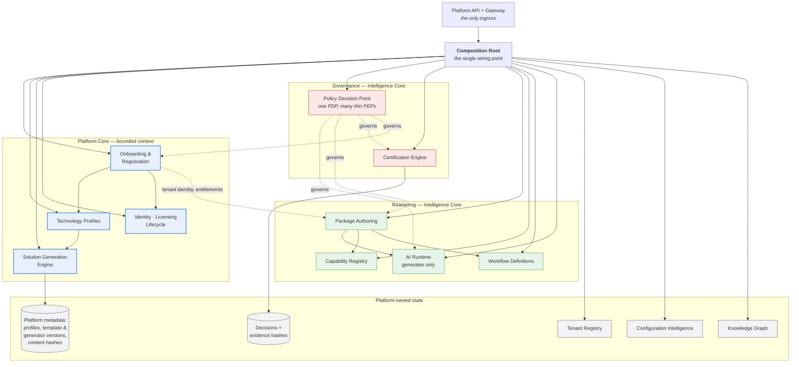
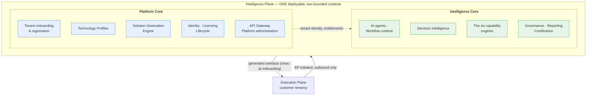

# 03 — Intelligence Plane Architecture

**Status:** **FROZEN** · **Version:** 1.1 · **Date:** 2026-07-22 · **Milestone:** P1 / M1.2
**Governed by:** [01 — Platform Constitution](01-platform-constitution.md), Rule 3
**Amendments:** v1.1 — Platform Core bounded context, Technology Profiles and the Solution Generation Engine added by [ADR-0021](../adr/ADR-0021-platform-core-bounded-context.md) (additive; no boundary changed)

**This document owns:** the internal structure of the Intelligence Plane, including its bounded contexts, technology profiles and the solution generation engine.
**It does not own:** the Execution Plane ([04](04-execution-plane-architecture.md)), transport ([05](05-cross-plane-communication.md)), the orchestration lifecycle ([12](12-capability-orchestration.md)), or AI provider abstraction ([13](13-ai-operating-model.md)).

---

## 1. Responsibility

The Intelligence Plane **reasons, decides, and governs**. It authors what shall be done and judges what was done. It never performs work and never touches a customer system.

It is DBiz-owned, multi-tenant, and horizontally scalable.

## 2. Internal structure

The plane is organised into the two bounded contexts of §2a. The subgraphs below sit
inside those contexts; **"platform state" here means platform-owned stores, not the
Platform Services of documents 23–25**, which are a different concept entirely.

**The dependency arrow runs Platform Core → Intelligence Core and never back** (R-03.23). Onboarding supplies tenant identity and entitlements to authoring; authoring knows nothing of onboarding.

**Governance reaches both contexts.** The Policy Decision Point governs onboarding as it governs authoring and certification — a tenant being provisioned is subject to policy exactly as a run being authored is.

## 2a. Bounded contexts — Platform Core and Intelligence Core

**Added at v1.1 by [ADR-0021](../adr/ADR-0021-platform-core-bounded-context.md).**

**R-03.20** The Intelligence Plane contains exactly **two logical bounded contexts**. They are contexts within **one deployable**, not deployables of their own. R-1.1 is unaffected: there remain exactly two deployable runtimes platform-wide.

**R-03.21** **Platform Core** owns: tenant onboarding and registration, technology profiles, solution generation, repository and deployment package generation, identity, registration, licensing, tenant lifecycle, the API gateway and platform administration.

**R-03.22** **Intelligence Core** owns: AI agents, the workflow runtime, decision intelligence, the six capability engines, governance, reporting and certification.

**R-03.23** The dependency direction is **Platform Core → Intelligence Core** for tenant identity and entitlements only. **Intelligence Core SHALL NOT depend on Platform Core.**

**R-03.24** Neither context is separately deployable, separately versioned, or separately addressable from outside the plane. **A context that acquired its own listener would be a third runtime** and a Rule 1 violation (R-1.5, R-16.2).

### Why two contexts rather than two services

Onboarding a tenant and reasoning about a test run are different problems on different clocks. Onboarding is **episodic, stateful and long-running**; reasoning is **per-request and stateless** (R-03.14). Holding them in one undifferentiated plane makes the statelessness rule impossible to state precisely, because part of the plane legitimately holds state.

Separating them as **contexts** rather than **deployables** preserves R-1.1 while making each rule apply where it is true: R-03.14's statelessness governs Intelligence Core; Platform Core's provisioning state is declared, bounded and tenant-scoped.

## 2b. Technology Profiles

**R-03.25** A **Technology Profile** declares the customer's chosen stack and drives solution generation. It SHALL declare: language · framework · test runner · CI/CD system · Git provider · cloud provider · deployment model · package manager · reporting framework · framework versions.

**R-03.26** A Technology Profile SHALL NOT influence the **internal implementation language or runtime of the Intelligence Plane**. The profile describes what is generated *for the customer*, never what DBiz builds.

**R-03.27** Every declared profile field SHALL be consumed by generator code. **A profile field no generator reads is configuration theatre** (R-15.1 applied to profiles).

**R-03.28** A profile SHALL be validated against a registry of supported combinations at onboarding. **An unsupported combination fails at onboarding, loudly** — not at generation, and not in the customer's first build.

**R-03.26 is the boundary that keeps the platform tool-agnostic in both directions.** Without it, a customer choosing a stack would exert pressure on DBiz's own implementation, and the profile would become a coupling rather than a parameter.

## 2c. Solution Generation Engine

**R-03.29** The Solution Generation Engine produces a complete, deployable Execution Plane solution from a Technology Profile, with **no manual engineering**.

**R-03.30** It SHALL generate: repository and project structure · the automation framework for the declared runner · utilities · configuration · logging · reporting · test data scaffolding · shared libraries · container definitions · CI/CD pipelines · infrastructure and deployment templates · documentation · coding standards · and the **bootstrap registration client**.

**R-03.31** Generation is **deterministic**: the same profile and the same generator version produce byte-identical output. Generation is evidence, and non-reproducible evidence is not evidence ([ADR-0020](../adr/ADR-0020-continuous-verification.md)).

**R-03.32** Generated output SHALL contain **no secret material** — no API keys, no credentials, no tokens (INV-2, §2d).

**R-03.33** Generated output SHALL be **delivered to the customer**, not retained. The Intelligence Plane SHALL NOT store the generated repository, its source, or any customer runtime asset (R-3.4).

**R-03.34** The engine SHALL record, as platform metadata only: the profile used, the generator version, the template versions, and a content hash of what was generated. **This is sufficient to prove what was produced without retaining it.**

**R-03.35** Templates SHALL be versioned, and a generated solution SHALL record the template versions it was built from, so a later upgrade can compute what changed.

**R-03.33 and R-03.34 together are how generation stays inside the sovereignty model.** The platform must be able to say what it generated — for support, upgrade and certification — without holding the customer's code. A content hash answers "what did you generate?" without retaining the answer's contents, exactly as an evidence hash answers "what was judged?" without retaining the evidence ([10](10-evidence-flow-model.md)).

## 2d. What Platform Core SHALL NOT hold

**R-03.36** Platform Core SHALL NOT store: customer source code or repositories · customer secrets or credentials · customer business configuration · test data · screenshots or evidence · internal customer URLs · application integration details · runtime configuration.

**R-03.37** Platform Core holds **platform metadata only**: tenant registration records, technology profiles, template and generator versions, licensing and entitlement state, and content hashes of generated artefacts.

**R-03.38** The one-time registration credential issued during onboarding SHALL be single-use, short-lived, and SHALL NOT be a long-lived API key ([08](08-security-model.md) §5a).

## 3. The composition root

**R-03.1** There SHALL be exactly **one composition root**. It is the only place runtime components are constructed and injected into one another.

**R-03.2** Components SHALL be wired **only through their public interfaces** — no internals, no reflection, no privileged access.

**R-03.3** The composition root SHALL contain **zero business logic**. It wires and delegates; it knows nothing of domains, tools, or customers.

**R-03.4** No component SHALL construct another component.

**Why centralise wiring.** Components that wire each other acquire mutual knowledge and eventually cycles. One composition root makes the dependency graph explicit, auditable in a single file, and mechanically checkable. It also means adding a capability, a provider, or a tool requires **no change to the root** — only a registry entry.

**R-03.5** A component that must never bind a network listener SHALL NOT export the means to do so.

*Rationale.* In the predecessor, the control plane satisfied the two-deployables rule only because nothing happened to call an exported start function. The capability existed and was one line from being used. **Conformance by accident is not conformance** — prefer structural impossibility (C-0.1).

## 4. Governance is a decision point, not a library

**R-03.6** There SHALL be exactly **one Policy Decision Point**. Policy logic exists nowhere else.

**R-03.7** Enforcement points SHALL be thin: they assemble context and delegate. **A policy enforcement point owns no policy logic.**

**R-03.8** Every governed path SHALL have an enforcement point, and the mapping of paths to enforcement points SHALL be explicit and machine-readable, so that adding an ungoverned path fails the build.

This is the standard one-PDP-many-PEPs pattern. Its value is that policy is changed in one place and cannot be quietly forked into a second interpretation at a call site.

Detail in [18](18-governance-model.md).

## 5. Reasoning and the AI boundary

**R-03.9** Package authoring SHALL compute a **deterministic result first**. AI enrichment is additive and may refine, never remove or override, structure (R-8.3).

**R-03.10** No AI output SHALL reach a decision, gate, threshold, or verdict (R-8.2, INV-4).

**R-03.11** The AI runtime is reachable **only** through the abstraction layer, never directly by a capability or authoring component.

**R-03.12** The Intelligence Plane SHALL author exactly **one** execution package per run, sealed and content-addressed (R-4.1, R-4.2).

**R-03.13** There SHALL be exactly one authoring path. An imperative alternative SHALL NOT exist (R-4.5).

**On R-03.13.** The predecessor built the conformant authoring path, proved it worked, and left it behind an opt-in flag — so every deployment ran the other one. **Defaults are architecture.** If two paths exist, the non-conformant one is what ships.

## 6. Statelessness

**R-03.14** The Intelligence Plane SHALL hold **no run state between requests**. Run state lives in the execution package and in the Execution Plane.

**R-03.15** Persistent state is limited to: tenant registry, configuration, capability and workflow definitions, knowledge graph, and **decisions with evidence hashes**.

**R-03.16** The Intelligence Plane SHALL NOT persist evidence payloads (INV-1, R-9.1).

**Consequence.** Statelessness with respect to a run is what permits horizontal scaling without coordination, and it is what allows a run to survive an Intelligence Plane instance restart. It is also a sovereignty property: an Intelligence Plane that holds no run state has less to leak.

## 7. Multi-tenancy

**R-03.17** Every operation SHALL be executed in an explicit tenant scope. There is no ambient or default tenant.

**R-03.18** Tenant scope SHALL derive from authenticated identity, never from a caller-supplied field alone.

**R-03.19** A run identifier is **not** a tenant identifier. Uniqueness carries no isolation semantics (R-9.6).

Isolation mechanics are owned by [07](07-tenant-isolation.md); tenant lifecycle by [21](21-tenant-lifecycle.md).

## 8. What SHALL NOT exist in this plane

| Prohibited | Rule |
|---|---|
| Browser, load-generation, or scanning capability — **even dormant, even unreferenced** | R-3.5 |
| Connections to customer systems | R-3.2 |
| Customer credentials or secret material | R-3.3, INV-2 |
| Permanent customer data | R-3.4, INV-6 |
| Execution sequencing | R-2.1 |
| Any decision computed by a model | R-8.2 |
| A second composition root | R-03.1 |
| Policy logic outside the decision point | R-03.6 |

**On dormancy.** Capability present is capability one wiring change from active. Dead code in the wrong plane is a latent sovereignty breach, not a harmless artefact — and it is indistinguishable from live code to an auditor reading a dependency manifest.

## 9. Conformance criteria

| # | Criterion | Verified by |
|---|---|---|
| **C-03.1** | Exactly one composition root; no component constructs another | Composition gate over the module graph |
| **C-03.2** | No deep imports into component internals | Import-depth gate |
| **C-03.3** | The composition root contains no domain, tool, or customer logic | Root content gate |
| **C-03.4** | No browser/load/scan dependency appears in the dependency graph | Dependency ban gate + import scan |
| **C-03.5** | Exactly one Policy Decision Point; no policy logic elsewhere | Policy-location gate |
| **C-03.6** | Every governed path has a registered enforcement point | Coverage matrix gate — an unregistered path fails the build |
| **C-03.7** | No model output reaches a decision site | Decision-site fitness test |
| **C-03.8** | Exactly one authoring path; no flag selects between authoring paths | Single-path gate |
| **C-03.9** | No run state survives between requests | Statelessness test: run completes across an instance restart |
| **C-03.10** | No evidence payload is persisted | Store-schema gate |
| **C-03.11** | No operation executes without an explicit tenant scope | Scope-requirement test |
| **C-03.12** | No listener-binding capability is exported from a component that must not bind | Export-surface gate |
| **C-03.13** | Exactly two bounded contexts exist, and neither is separately deployable | Context inventory gate; listener inventory |
| **C-03.14** | Intelligence Core does not depend on Platform Core | Dependency-direction gate |
| **C-03.15** | No Technology Profile field influences Intelligence Plane implementation | Profile-consumer scan over IP source |
| **C-03.16** | Every declared Technology Profile field is consumed by generator code | Declared-versus-consumed gate for profiles |
| **C-03.17** | An unsupported profile combination fails at onboarding | Negative onboarding test |
| **C-03.18** | Generation is deterministic — same profile and generator version yield byte-identical output | Twice-generate comparison |
| **C-03.19** | Generated output contains no secret material | Secret scan over generated artefacts |
| **C-03.20** | No generated repository, source file or customer runtime asset is retained in the Intelligence Plane | Store-content scan |
| **C-03.21** | Generation is recorded as profile, versions and content hash only | Metadata schema gate |
| **C-03.22** | Platform Core stores no customer secret, repository, screenshot or business configuration | Platform Core store-content scan |

## 10. Open items

| # | Item | Target |
|---|---|---|
| **AD-001** | Language and runtime | M1.6 |
| **AD-013** | Knowledge graph storage model and query surface | M1.5 |
| **AD-014** | Horizontal scaling and regional deployment model | M1.5 — see [17](17-deployment-topology.md) |
