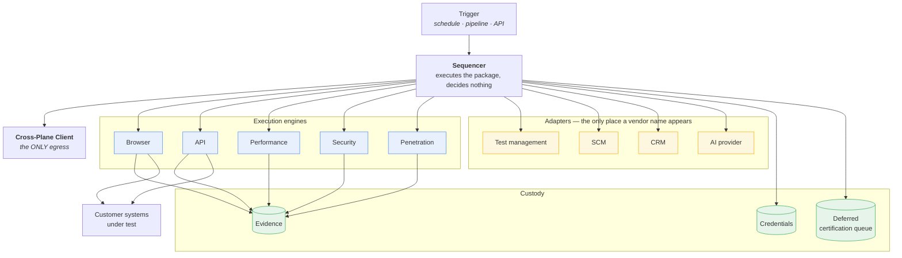

# 04 — Execution Plane Architecture

**Status:** **FROZEN** · **Version:** 1.0 · **Date:** 2026-07-22 · **Milestone:** P1 / M1.2
**Governed by:** [01 — Platform Constitution](01-platform-constitution.md), Rule 2

**This document owns:** the internal structure of the Execution Plane.
**It does not own:** the Intelligence Plane ([03](03-intelligence-plane-architecture.md)), transport and degradation semantics ([05](05-cross-plane-communication.md)), adapter interface design ([14](14-tool-operating-model.md)), or evidence integrity ([10](10-evidence-flow-model.md)).

---

## 1. Responsibility

The Execution Plane **performs work and custodies what it produces**. It sequences a package authored elsewhere, executes against customer systems, captures evidence, and holds it.

It is **customer-owned**, runs inside the customer's tenancy, and serves exactly one tenant.

## 2. Internal structure

## 3. The sequencer decides nothing

**R-04.1** The sequencer SHALL execute the operations of an execution package **in order**, and SHALL make no certification decision.

**R-04.2** It SHALL validate the package before executing: provenance, content hash, validity window, and the proceed flag.

**R-04.3** If the package indicates refusal, the sequencer SHALL **halt** and report the refusal reason unchanged.

**R-04.4** The sequencer SHALL execute a package or refuse it. It SHALL NOT modify one (R-4.3).

**R-04.5** There SHALL be exactly one sequencing path. No imperative alternative may exist (R-4.5).

**The gate is deliberately trivial.** Checking a flag and halting is a handful of lines, and that is the point: the Execution Plane is *structurally incapable* of overturning an Intelligence Plane decision, because it never evaluates one. It reads a boolean it did not compute.

## 4. Execution modes are a transport concern

**R-04.6** Dry-run and live execution SHALL differ **only** inside the adapter that talks to the external system. There is **one code path** through the sequencer and engines.

**Rationale.** Two code paths means the rehearsed path is not the path that runs in production, and every defect found in dry-run is only probably the defect that exists live. Confining the difference to the adapter keeps the rehearsal faithful.

## 5. Custody

### 5.1 Credentials

**R-04.7** Credentials are held **exclusively** in this plane (INV-2, R-6.3).

**R-04.8** Only credential **references** cross the boundary — never secret material, in any environment, including diagnostics and error payloads.

**R-04.9** Credentials SHALL be resolved at point of use, not gathered into a process-wide store.

### 5.2 Evidence

**R-04.10** Evidence is captured, hashed with the canonical primitive, and **retained here** as the authoritative copy (INV-1, R-9.1).

**R-04.11** Only evidence **references and hashes** cross the boundary (R-05.7 in [05](05-cross-plane-communication.md)).

**R-04.12** Every evidence record SHALL reference the execution package hash that produced it (R-4.4), so the chain from decision to evidence is reconstructible in both directions.

**R-04.13** Every evidence store SHALL declare a retention source, implement purge, and ship a test proving data is unreadable after expiry (R-9.3). Immutability SHALL NOT be used to justify indefinite retention (R-9.4).

### 5.3 The deferred certification queue

**R-04.14** When the Intelligence Plane is unavailable, evidence SHALL be **durably queued** for later certification. It is never discarded, and certification is never delegated to this plane (R-10.2).

**R-04.15** The queue SHALL survive process restart and SHALL define delivery, ordering, expiry, and back-pressure semantics.

**This queue is not incidental infrastructure.** It is the mechanism by which "testing continues, judgment waits" becomes true. Without it, degraded operation silently loses the evidence it produced, and the platform's availability promise becomes a promise to keep running while forgetting what happened.

## 6. Operating without the Intelligence Plane

**R-04.16** The Execution Plane SHALL execute with the Intelligence Plane unreachable (INV-7, R-2.6).

**R-04.17** Capabilities requiring no reasoning — those driven entirely by deterministic tooling — SHALL be **fully available** in that state.

**R-04.18** Behaviour under unavailability is fully determined by the degradation matrix in [05](05-cross-plane-communication.md) §4. The Execution Plane SHALL NOT emit a verdict in any degraded state.

**R-04.19** Unavailability SHALL NOT produce an abort path. Retry exhaustion yields degradation.

**This is the invariant the predecessor most conspicuously failed.** Its agent layer implemented AI independence thoroughly and consistently; a single early return in this plane discarded all of it, and every capability inherited the defect — including those that needed no inference whatsoever.

## 7. Single tenancy

**R-04.20** This plane serves **exactly one tenant**: the customer whose tenancy it runs in.

**R-04.21** It SHALL contain **no multi-tenant logic** — no tenant routing, no tenant selection, no cross-tenant data structures (R-2.5).

**The security value is structural.** A deployment that has no concept of a second tenant cannot leak to one. This removes an entire defect class by construction rather than by test, which is the strongest available form of enforcement (C-0.1).

## 8. What SHALL NOT exist in this plane

| Prohibited | Rule |
|---|---|
| AI inference | R-2.2, INV-4 |
| Certification decisions or verdicts | R-2.3, R-10.1 |
| Workflow or package authoring | R-2.4 |
| Multi-tenant logic | R-2.5 |
| An abort path on Intelligence Plane unavailability | R-04.19 |
| A second sequencing path | R-04.5 |
| A vendor name outside an adapter | R-7.2 |
| Secret material in any outbound payload | R-6.2 |

**On the AI prohibition.** This plane may *route to* a tenant-configured AI provider on behalf of the Intelligence Plane's abstraction where architecture requires it, but it SHALL NOT itself perform inference or possess inference capability. The distinction is between holding a credential and forming a judgment.

## 9. Conformance criteria

| # | Criterion | Verified by |
|---|---|---|
| **C-04.1** | No inference library or model-invocation code is present | Dependency ban gate; import scan; boot guard |
| **C-04.2** | The process refuses to start if inference capability is detected | Boot guard, exercised in CI |
| **C-04.3** | No code path produces a verdict or certification | Verdict-site fitness test |
| **C-04.4** | Execution completes with the boundary severed | Severed-boundary integration test |
| **C-04.5** | No abort path exists on unavailability | Fault-injection test asserting degradation |
| **C-04.6** | Exactly one sequencing path; no flag selects between paths | Single-path gate |
| **C-04.7** | The sequencer never mutates a package | Immutability test on the package object |
| **C-04.8** | No secret material appears in any outbound payload, in any environment | Outbound guard; secret-scan gate |
| **C-04.9** | Every evidence record carries its package hash | Schema gate |
| **C-04.10** | Every evidence store has a passing purge test | Store registration gate |
| **C-04.11** | The deferred queue survives process restart | Durability test |
| **C-04.12** | No multi-tenant construct exists | Source scan for tenant-routing patterns |
| **C-04.13** | No vendor identifier appears outside an adapter directory | Vendor-name scan |
| **C-04.14** | Dry-run and live differ only within adapters | Path-equivalence test |

**C-04.2 and C-04.1 are deliberately redundant**, and a third mechanism — the container entrypoint — is added in [17](17-deployment-topology.md). Rule 2 is a sovereignty rule, and R-8 of the enforcement hierarchy (C-0.2) requires at least three independent mechanisms. The one predecessor rule enforced this way never drifted.

## 10. Open items

| # | Item | Target |
|---|---|---|
| **AD-001** | Language and runtime | M1.6 |
| **AD-008** | Whether a last-known-good package is cached, and its validity window | M1.2 — [05](05-cross-plane-communication.md) |
| **AD-009** | Durable queue technology and its semantics | M1.2 — [05](05-cross-plane-communication.md) |
| **AD-015** | Concurrency model for thousands of simultaneous executions per tenancy | M1.5 — [16](16-runtime-model.md) |
